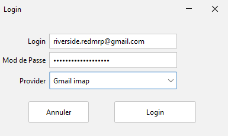
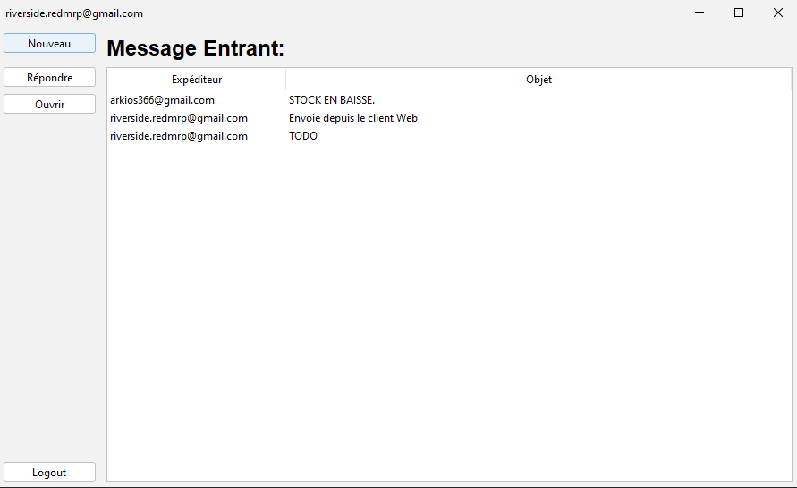
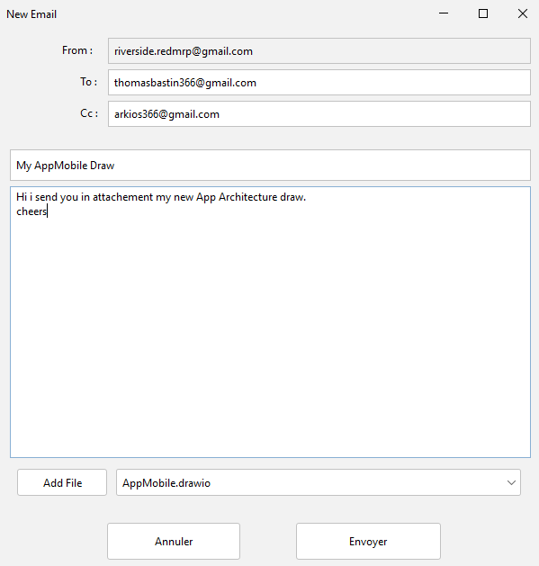
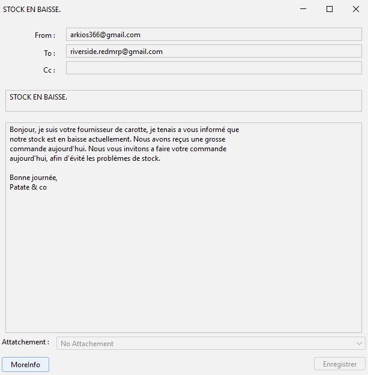
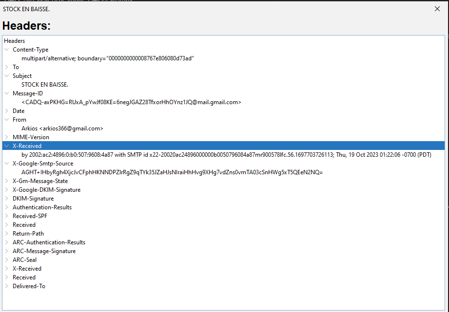

# Java_Mail_User_Agent
This app let user connect to their Mailbox using Pop3 or Imap  (compatible Google &amp; Outlook)

## Features
- Google Imap/Pop3 Connexion
- Outlook Imap/Pop3 Connexion
- Reiciving Mail Text and attachements
- Sending Mail Text and attachements
- An automatic Inbox refresh (Thread)
- Full Responsive UI
- Mail's Headers Tracker

## How To Compile
1) Install JDK 18 or later.
1) Use Netbeans 19 or later to open the project.
1) Once open, press Compile, and enjoy.

## How to configure Your Email Account
[Gmail Connexion Tutorial](https://support.google.com/accounts/answer/185833?sjid=12283184658883965116-EU)

Nothing to do for Outlook

## In Action:

